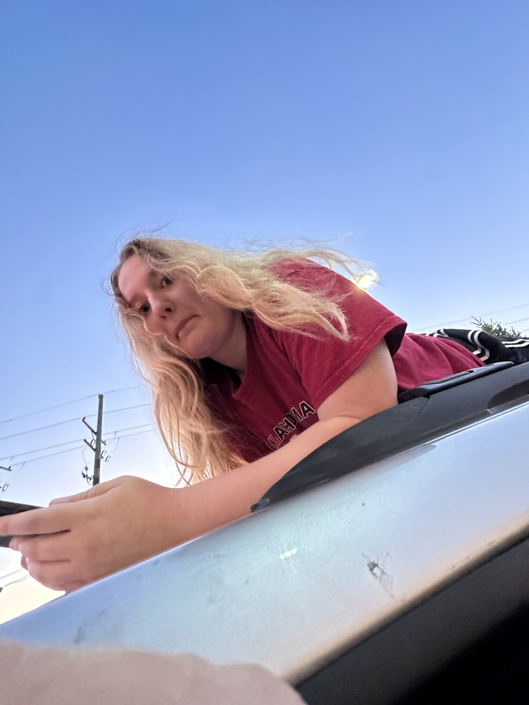

<html>

<head>
    <title>My Personal Website</title>
</head>

<body>

<h1>Joey's Website</h1>

<h2>Bio</h2>

Hi, my name is Joey. I'm a college student who enjoys playing video games and is looking to help create them one day.
I enjoy learning how games are designed and spending time playing games a little too much.

<h2>Gaming</h2>

<h3>Why I Like Gaming</h3>

Gaming is fun because it combines competition, creativity, and problem solving.
Many games also have strong communities and teamwork. Having a commutity with shared interests is very important in helping you grow as a person.

<h3>My Favorite Types of Games</h3>

I enjoy first-person shooters, battle royale games, and competitive multiplayer games.

<h3>Why Games Are Important</h3>

Games are not just entertainment, they are also used for storytelling, education,
and even training simulations.

<h2>My Top 5 Favorite Games of All Time</h2>

<ol>
<li><a href="https://www.callofduty.com/blackops2">Call of Duty: Black Ops 2</a></li>
<li><a href="https://www.lego.com/en-us/themes/star-wars/games">Lego Star Wars</a></li>
<li><a href="https://supermariobros.nintendo.com">Super Mario Bros Wii</a></li>
<li><a href="https://mariokart8.nintendo.com">Mario Kart Wii</a></li>
<li><a href="https://www.minecraft.net">Minecraft</a></li>
</ol>

</body>

</html>
